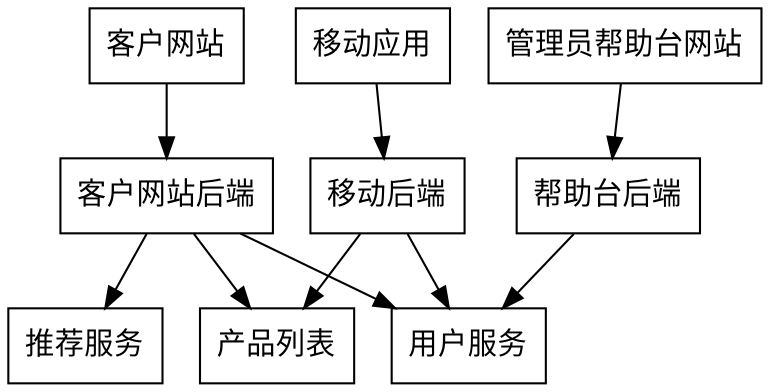

# 微服务设计

## 微服务

### 什么是微服务

微服务是小而自治的服务。

关于小的标准比较模糊，作者给出了两种考虑角度
1. 当不觉的一个代码库过大的时候，他就足够小了（感觉太主观了）
> 代码库也不一味的小。虽然服务越小，越能体会到微服务的优点，但他的缺点--管理众多微服务的问题--也会更加突出。
2. 是否于团队结构相匹配。如果代码库过大，小的团队维护会十分困难。

关于自治性。每个微服务都是独立的，可以单独部署。并且修改一个服务并对其重新部署，不会影响其他服务。

### 微服务的好处

1. 技术异构性。不同的服务可以根据需求选择不同的语言实现。
2. 弹性。便于处理服务不可用问题和服务降级问题。
> 服务降级问题：服务降级一般是指在服务器压力剧增的时候，根据实际业务使用情况以及流量，对一些服务和页面有策略的不处理或者用一种简单的方式进行处理，从而释放服务器资源的资源以保证核心业务的正常高效运行。
3. 扩展。经扩展需要扩展的服务。
4. 简化部署。
5. 与组织结构相匹配。对于小团队，微服务代码更容易维护。
6. 服务可替换性。由于所有的服务都是独立的，对于某存在问题或需优化的服务，可以重新构建而不影响其他服务。

### 正确认识微服务

微服务并不是万能的。他有优点也有相应的缺点--如何管理众多的微服务等缺点。

## 架构师

- 未来的变化难以预料，所以与其对所有可能的变化进行预测，不如做一个允许变化的系统。
- 架构师的职责之一就是保证该系统适合开发人员在其上工作。
- 架构师应该专注在大方向上，只有在有限的情况下参与到非常具体的细节实现上。而且必须保证系统不仅能满足当前的需求，还应能够应对未来的变化。
- 架构师不应该过多关心模块内部如何实现，而应该多关注模块之间的事。
- 做系统设计方面的决定通常都是在取舍。
- 战略目标决定架构原则。架构原则决定设计和实践。
- 制定好的标准
    - 监控。实时获取服务的健康状况。
    - 接口。
    - 架构安全性。（等待后面的章节）
- 代码治理
    - 真实环境中的范例优于干瘪的文字描述。
    - 裁剪服务代码模块。基于开发实践提取通用的代码模版，提高开发速度。
        > 服务代码的模版的主要目的是简化开发工作，如果有将开发工作弄复杂的情况，应该慎重。
- 原则应该可以根据实践的反馈进行修改。
- 谨记小孩学自行车的过程示例。
    > 对于普通情况引导优于控制；对于可能导致严重问题的情况应该及时控制并制止。
    > 不过如何区分普通情况和严重情况十分困难。
- 架构师不仅仅只做技术决定。还要帮助队友成长，使他们理解技术愿景，并保证他们能够积极参与到技术愿景的实现和调整中去。
- 伟大的软件来自伟大的人。
- 如何更好的平衡取舍才是关键。

## 如何建模服务

### 原则及含义
好的微服务需要专注的概念`松耦合`和`高内聚`。

松耦合。简单的理解就是，每个微服务之间不相互依赖，部署一个服务时不会影响到其他的服务。

高内聚。把因相同原因而变化的东西放在一起，把应不同原因而变化的东西分离开。更具体一点是对于一个特性做修改，应该仅修改一处。

### 界限上下文（bounded countext）

- 界限上下文分为两部分，一部分需要与外部通信，另一部分不需要与外部通信。每个上下文都有明确的接口，接口决定了暴露那些内部模型给其他上下文。
- 避免过早划分。过早划分微服务的代价很高。而将一个已有的代码库划分为微服务，要比从头构建简单的多。
- 从功能考虑上下文，而避免仅仅从数据上考虑。
- 逐步划分。先划分大的`界限上下文`，完成之后在考虑将大的拆分为小的。

## 集成

选择集成技术时，首要考虑的问题是--我们希望从这些技术中得到什么？

- 避免破坏性修改。
- 保证API的技术无关性。
- 隐藏内部实现细节。（所有倾向与暴露内部实现细节的技术都不应该被采用，这会形成耦合点）
- 同步--基于请求/响应。异步--基于事件。
- RPC
    - 避免使用的RPC与某种技术耦合。
    - 始终警惕RPC，远程调用并不完全等同于本地调用，即网络并不是可靠的。
    - 警惕RPC的脆弱性。避免修改RPC数据结构后需要同时重新部署客户端和服务器端的情况。
- REST
    - 基于http，可以方便地使用http相关的技术。
    - 对低延迟通信和较小的消息尺寸的需求并不适合。
- 不要在客户端和服务器端共享代码。避免由于共享代码造成客户端与服务器端之间的耦合。
    > 在微服务内部不要违反`DRY`，但在跨服务的情况下可以适当违反`DRY`。
- 按引用访问。通过引用获取数据，避免存储一份数据后数据源被修改，造成的数据不同步的问题。
- 接口版本管理
    - 宽进严出。对自己发送的东西要严格，对接受的东西要严格。
    - 尽量避免破坏性修改。
    - 使用语义化的版本管理
    - 允许不同版本的接口共存。当发布一个破坏性接口时，可以保留旧的接口。
    - 允许不同版本的服务共存。老用户只能看到老版本的服务，新用户只能看到新版本的服务。
- 用户界面
    - API组合。前端一个页面的不同组件分别调用不同的接口。
        > 为了节省用户的流量，可以设置gateway将多个服务请求聚合在一起。
    - UI组合。后端直接返回UI组件。
    - 为前端服务的后端[Backends For Frontend](#BFF)。在前端与服务之间单独做一层，为前端定制数据。
        > 需要额外强调的是`BFF`并应该包含任何业务逻辑。
- 与第三方软件集成
    - 第三方软件的一般存在很多的不可控性，而且难以对其做定制化开发。应当避免将其作为系统的中心，而应该把它仅视为一个服务。**合理的方法是在第三方软件之上做一层包装，将定制开发放在包装层。**
    - `绞杀者模式`。对于遗留的老系统的处理，也可以使用**套壳**的方式处理，将修改的功能放在包装层，并且逐步减少对老系统的调用，直到完全替换老系统。

## 分解单块系统

如何合理的分解一个单块系统。

- 着手点的选择--寻找分离出去之后收益最大的部分。
- 共享静态数据应该放在配置文件或代码中，不应该存放在数据库中（有成为耦合点的可能）。
- 重构数据库。

    当尝试将一个单块服务分解为多个服务时，**从数据库开始分解但不分级服务**是个不错的主意。这样做的优点是分解的同时不会影响任何服务的消费者。而当分解不合适时可以快速回退而不影响服务的调用。

- 报表数据库

    通常的做法是为报表系统copy一份数据库，并周期性的同步两个数据库之间的数据。不过这会造成报表系统与服务系统的耦合。

    而当对数据进行分析时，可能需要引入不同的拥有某种特性的数据库。上面的做法并不支持这样做。

    - 报表系统主动拉数据。可以定制特殊的接口，批量传输数据。
    - 定时任务向报表系统推数据。在服务中增加数据导出功能，通过定时任务周期触发想报表数据库插入数据。（将服务与该服务的数据导出工作，进行同一管理可以缓解服务与数据导出功能的耦合）
    - 基于事件的数据导出。编写客户端代码订阅微服务中导致数据变化的事件。（感觉很有意思）

- 修改的代价
    - **我们可以也必然会犯错，要接受这个事实。但同时我们应该做的事是，理解如何降低这些错误造成的影响。**
    - 对于单块服务的分解是困难的。**为了控制风险，可以先从影响最小的地方着手。**

- CRC（class-responsibility-collaboration）。将所有服务的功能列出来，在脑中不断的演练，直到所有的服务能够正确地在一起工作。

### BFF

## 测试

- 单元测试、服务测试、端到端测试
- 再怎么测试也不可能消除所有的错误，所以系统的监控和修复是十分重要的。
- 仅仅依靠部署之前进行的测试，并不能把缺陷率降为0。
- 服务及时回归是保证新服务引入的缺陷影响最小化的重要手段。
- 蓝/绿发布与金丝雀发布:

    `蓝绿发布`和`金丝雀发布`都会同时存在两个版本的服务，通过复制或引导流量的形式对服务进行测试。

    蓝绿发布和金丝雀发布的不同点是。蓝绿发布两个服务的同时存在的时间较短。蓝绿发布的关注点是流量逐渐从旧版服务向新版本服务迁移。而金丝雀发布的关注点是对比两个服务的性能，验证新服务是否能够达到预期的效果，期间可能多次调整新旧服务之间的浏览比例。

    > 使用蓝绿发布和金丝雀发布的考量是，其实我们无法在服务发布前发现和捕获所有缺陷。
- 验证想法是否可行的重要性大于验证是否引入可一个缺陷。
- 尝试理解投入更多的努力测试与更快地在生产环境发现问题之间的权衡。

## 监控

- 最低限度的监控指标--响应时间。做好之后可以监控错误率等其他指标。
- 监控cpu等主机层级的指标。
- 关联标识。生成一个标识并随服务的调用链传递，这样可以方便的对服务调用进行跟踪。
- 保证关联标识的一致性。最好统一处理，避免需要每次手动处理有时遗漏标识的问题。
- 服务级联问题。每个服务实例都应该追踪并显示其下游服务器的健康状态。
- 让做正确的事变得容易。
- 搜集那些数据，考虑的角度:
    - 现在需要知道什么
    - 以后需要知道什么
    - 如何消费数据