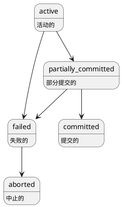

# 事务

## 事务的状态
最后一条命令执行完毕之后，事务进入`partially_committed`状态。直到数据写入磁盘，及时数据库崩溃数据也不会丢失时，事务才进入`committed`状态

## ACID
- 原子性
  - 要么成功，要么失败
- 一致性
  - 事务前后的状态一致
- 隔离性
  - 多个事务并行且互不影响
- 持久性
  - 事务一旦成功，即使系统崩溃数据依然不会丢失

## 事务的隔离级别
- 可串行化
  - 事务的调度等价于串行调度。`如果一个调度等价于一个串行调度，则这个调度被称为可串行化调度`
- 可重复读
  - 仅读取已提交的数据，一个事务中对指定数据的多次读取时，其他事务无法修改该数据
- 已提交读
  - 仅读取已提交的数据
- 未提交读
  - 可以获取未提交的数据

### 事务避免的问题
- 脏写: 多个数据同时修改同一份数据。事务的四种隔离级别都解决了该问题
- 脏读: 读取已但未提交的数据
- 不可重复读: 同一事务中多次读取的指定数据出现不一致的情况
- 幻读: 一个事务对于谓词读(where条件)，读取到其他事务插入的数据

### 事务隔离级别的实现
- 基于锁
  - 共享锁和排他锁
- 基于时间戳
- 多版本/数据快照
  - 每个事务开始时都有一份数据库版本或快照。读取数据时从快照中获取
  - 仅当没有其他并发事务已经修改该事务更新的数据时，事务进入提交状态

## 并发控制

- 基于锁的协议
- 基于时间戳的协议
- 基于多版本的协议

### 基于锁的协议

共享锁/排他锁

两阶段封锁协议:
- 增长阶段: 事务可以获取锁，但不释放锁
- 缩减阶段: 事务可以释放锁，但不能获得新锁

### 快照隔离

快照隔离不能保证可串行化

## 恢复系统

### 存储器
- 易失性存储器
- 非易失性存储器
- 稳定存储器
  - 通常由多个非易失性存储器构成，数据同时存储在多个非易失性存储器。当一部分数据丢失，就使用其他数据将其恢复

### 日志

数据库通过`日志`实现事务的`原子性`和`持久性`

日志一般由`事务标识`、`数据项标识`、`旧值`、`新值`构成。

日志一般在数据实际写入磁盘之前，写入日志文件。

*redo*

*undo*

*检查点*
