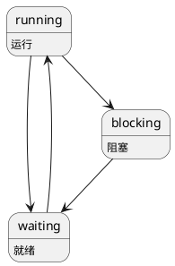

# process & threading & interrupt

## 进程

- 进程之间资源不共享
- 进程的状态及状态切换
  - 运行态
  - 就绪态
  - 阻塞态



## 线程

- 一个进程可以包含多个线程，且所有线程共享进程的所有内存
- 每个线程拥有自己独立的堆栈，不同的线程执行不同的代码
- 由内核控制线程的调度
- 在上下文切换时，线程相较于进程需要的指令更少。这使线程的上下文切换速度快于进程

## 协程（用户级线程）

- 协程运行在单个线程中（无法发挥多核的优势）
- 由定制的逻辑控制协程的调度
- 不需要陷入内核，不需要上下文切换，调度更加便捷

## 中断
- 系统中断
  - 时钟中断: 系统为每个进程分配固定的cpu时间（cpu时间片），当进程的运行时间超过分配的时间，则强制切换cpu到其他进程运行。
  - io中断: 当通过io读取数据完成时（例如读取磁盘文件、读取网络数据），触发中断。
- 程序中断
  - 报错（除数为0等）

中断发生时，会首先触发中断处理逻辑，优先保存当前的调用栈等数据，之后挂起当前进程并切换cpu到引发中断的进程运行。

io中断是异步发生的，大致的步骤如下：
1. cpu发出读取io数据的指令
2. 进程等待数据，被阻塞
3. 调度程序切换其他线程给cpu处理
4. io数据处理完毕，出发中断
5. cpu响应中断，保存当前堆栈、寄存器数据，触发中断处理逻辑。当前进程被挂起
6. 中断处理完毕，调度系统切换任务给cpu
  - 有可能切换的是当初被挂起的任务，也可能是其他的任务

### 多个中断

多个中断的情况介绍了两种方式
- 多个中断排队处理。当处理一个中断时，不允许被其他中断打断，而是将其他中断挂起，等待cpu一个个处理
- 定义中断优先级。允许高优先级的中断，打断低优先级的中断。

## 内核模式 & 用户模式
- 操作系统区分内核模式和用户模式是为了对用户程序能够访问的内存和指令做限制
- 内核模式能够使用cpu指令集的所有指令，并且访问任何内存位置
- 用户程序需要申请底层资源时，只能使用操作系统提供的接口
- 何时会发生用户模式到内核模式的切换
  - 中断

## 信号量
- p/v信号
- 条件变量

p/v信号控制互斥，条件变量控制进程的挂起和唤醒

### 生产者-消费者问题

- 生产者、消费者对于共享资源的使用必须互斥
- 当数据满时，生产者要被阻塞，直到被唤醒
- 当数据为空时，消费者要被阻塞，直到被唤醒

### 读者-写者问题

对于某共享资源，写者之间互斥，读者之间不互斥，但读者和写者之间互斥即有读者读共享数据时，写者被阻塞，当写者修改数据时，读者被阻塞。

```py
reader_count = 0
reader_count_lock = Lock()
rw_lock = Lock()

def reader():
  with reader_count_lock.acquire():
    reader_count += 1
    
    if reader_count == 1:
      rw_lock.acquire()
    
  reader.read()

  with reader_count_lock.acquire():
    reader_count -= 1

    if reader_count == 0:
      rw_lock.release()
  
def writer():
  with rw_lock.acquire():
    writer.write()
```

### 避免锁

**最快的锁就是没有锁**。

要点是对于获取共享资源时，要么获取旧版本数据，要么获取新版本数据。应当避免新旧数据的混合。

### 死锁

- 互斥锁加锁顺序规则: 给定一个互斥操作的全序，如果所有的线程都以一种顺序获得互斥锁并以相反的顺序释放，那么这个程序就是无死锁的。

### tips

- 同步开销巨大，要尽可能避免。如果不能避免，要用尽可能多的有效计算弥补同步开销。
